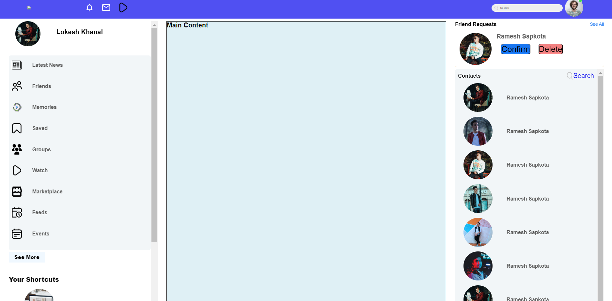

# Facebook Clone

This project replicates the UI of Facebook with HTML and CSS.

## Overview

The project consists of HTML and CSS files to create a layout resembling Facebook's interface. It includes:

- Navigation bar
- Left sidebar with important links and shortcuts
- Main content area
- Right sidebar with friend requests and contacts

## Features

- Responsive design for various screen sizes
- Animated emojis for an interactive user experience

## Project Structure

The project contains the following files and directories:

- `index.html`: HTML file for the Facebook clone interface.
- `style.css`: CSS file containing styles for the interface.
- `images/`: Directory containing image assets used in the project.

## Usage

To view the Facebook clone interface:

1. Clone this repository.
2. Open the `index.html` file in a web browser.

## Screenshots

screenshot1: So far it looks like this : after first commit:

Feel free to contribute by creating issues or pull requests!

🚀 Happy Coding! 🎉
